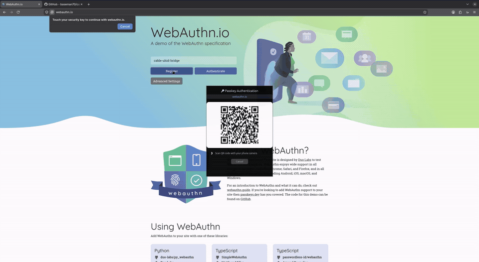

# cable-uhid-bridge

[](https://www.rust-lang.org)
[]()
[]()
[]()

A lightweight Linux background daemon providing **cross-device WebAuthn / Passkey authentication via caBLE v2 (QR code)** by emulating a virtual USB FIDO2 token over `/dev/uhid`.

<p align="center">
  
</p>

---

## The Problem Solved

Firefox and Chromium on Linux lack an OS-level platform authenticator with Hybrid Transport (caBLE). When logging into websites like GitHub, Google, or AWS with a mobile passkey (stored in iCloud Keychain or Google Password Manager), Linux browsers fall back to `libfido2`, which only looks for physical USB security keys.

`cable-uhid-bridge` bridges this gap completely without requiring browser modifications, custom browser patches, or compositor extensions:

```
┌────────────────────────────────────────────────────────┐
│  Browser / OS Client (Firefox, Chromium, Brave, PAM)   │
└───────────────────────────┬────────────────────────────┘
                            │ CTAPHID (Virtual USB over /dev/uhid)
                            ▼
┌────────────────────────────────────────────────────────┐
│  cable-uhid-bridge (/dev/uhid)                         │
│  - Emulates a physical FIDO2 USB Security Key          │
│  - Pops up Wayland/X11 QR modal automatically          │
│  - Verifies Bluetooth LE physical proximity (BlueZ)    │
│  - E2EE Noise WebSocket tunnel to Apple / Google relay │
└───────────────────────────┬────────────────────────────┘
                            │ caBLE v2 Tunnel (FIDO Hybrid)
                            ▼
┌────────────────────────────────────────────────────────┐
│  Mobile Device (iPhone / Android)                      │
│  - Biometric Verification (Face ID / Fingerprint / PIN)│
│  - Returns signed WebAuthn assertion / credential      │
└────────────────────────────────────────────────────────┘
```

---

## 📱 Verified Compatibility

| Mobile Platform | Credential Provider | Biometric Auth | Happy Path | Cancel Flow |
|---|---|---|:---:|:---:|
| **Apple iOS** (iPhone / iPad) | iCloud Keychain | Face ID / Touch ID | ✅ **Verified** | ✅ **Verified** |
| **Google Android** | Google Password Manager | Fingerprint / Screen Lock | ✅ **Verified** | ✅ **Verified** |

### Verified Relying Parties
* **GitHub** (`github.com`)
* **WebAuthn.io** (`webauthn.io`)
* **Google Accounts**

---

## 🚀 Quick Start (Automated Installer)

An automated installer is provided for systemd-based Linux systems (Arch, Pop!_OS, Ubuntu, Debian, Fedora):

```bash
git clone https://github.com/baseman70/cable-uhid-bridge.git
cd cable-uhid-bridge
./install.sh
```

### What `install.sh` Does Automatically:
1. **Prerequisite Auto-Detection & Installation**: Automatically checks for required system C libraries (`libdbus`, `libclang`, `libxkbcommon`) and the Rust toolchain, offering to install any missing dependencies automatically via your system package manager (`apt`, `pacman`, or `dnf`). For unattended setups, run with `./install.sh -y`.
2. **Kernel Module Setup**: Detects and loads the `uhid` kernel module and configures `/etc/modules-load.d/uhid.conf` so it persists across system reboots.
3. **Udev Permissions**: Installs `/etc/udev/rules.d/70-uhid.rules` with `TAG+="uaccess"`, enabling unprivileged desktop user access without `sudo`.
4. **Builds Release Binary**: Compiles `cable-uhid-bridge` and installs it to `~/.local/bin/`.
5. **Systemd User Service**: Configures, enables, and immediately starts `cable-uhid-bridge.service` under `systemctl --user`.
6. **Self-Verification**: Confirms the virtual token is registered and active in the Linux kernel.

### Uninstall Anytime
```bash
./install.sh --uninstall
```

---

## 📦 Packages & Precompiled Binaries

If you prefer installing prebuilt packages without compiling from source:

### 1. Debian / Ubuntu / Pop!_OS (`.deb`)
Download the `.deb` package from the [latest GitHub Release](https://github.com/baseman70/cable-uhid-bridge/releases):
```bash
sudo apt install ./cable-uhid-bridge_*_amd64.deb
systemctl --user enable --now cable-uhid-bridge
```

### 2. Arch Linux (AUR / `PKGBUILD`)
Install from the AUR helper of your choice, or build from the provided PKGBUILD:
```bash
cd contrib/arch
makepkg -si
systemctl --user enable --now cable-uhid-bridge
```

### 3. Precompiled Release Tarball
```bash
tar -xzf cable-uhid-bridge-v*-x86_64-unknown-linux-gnu.tar.gz
cd cable-uhid-bridge-*
./install.sh
```

---

## 🛠️ Manual Installation & Build from Source

If you prefer to install dependencies and configure the service manually:

### 1. Install Build Dependencies
* **Debian / Ubuntu / Pop!_OS / Linux Mint**:
  ```bash
  sudo apt update && sudo apt install -y build-essential pkg-config libdbus-1-dev libclang-dev libxkbcommon-dev curl
  ```
* **Arch Linux / Manjaro / EndeavourOS**:
  ```bash
  sudo pacman -S --needed base-devel pkgconf dbus clang libxkbcommon curl
  ```
* **Fedora / RHEL**:
  ```bash
  sudo dnf install -y gcc pkgconf-pkg-config dbus-devel clang-devel libxkbcommon-devel curl
  ```
* **Rust Toolchain**:
  ```bash
  curl --proto '=https' --tlsv1.2 -sSf https://sh.rustup.rs | sh
  ```

### 2. Configure Kernel Module & Udev Rule (One-Time)
```bash
sudo modprobe uhid
echo "uhid" | sudo tee /etc/modules-load.d/uhid.conf
echo 'KERNEL=="uhid", TAG+="uaccess"' | sudo tee /etc/udev/rules.d/70-uhid.rules
sudo udevadm control --reload-rules && sudo udevadm trigger -s misc -a name=uhid
```

### 3. Build & Install Binary
```bash
cargo build --release
mkdir -p ~/.local/bin
install -m 755 target/release/cable-uhid-bridge ~/.local/bin/
```

### 4. Enable Systemd User Service
```bash
mkdir -p ~/.config/systemd/user
cp contrib/cable-uhid-bridge.service ~/.config/systemd/user/
systemctl --user daemon-reload
systemctl --user enable --now cable-uhid-bridge.service
```

### 5. Monitor Service
```bash
systemctl --user status cable-uhid-bridge
journalctl --user -u cable-uhid-bridge -f
```

---

## How to Test

### 1. Verify Virtual USB Detection
Verify that `libfido2` detects your virtual security key:
```bash
fido2-token -L
```
Output will display:
```
/dev/hidrawX: vendor=0x1209, product=0x0001 (caBLE Virtual Passkey Token)
```

### 2. Test in Firefox or Chrome
1. Navigate to **[webauthn.io](https://webauthn.io)**.
2. Enter a test username (e.g. `test-user-1`).
3. Click **"Register"** or **"Authenticate"**.
4. The floating modal UI will pop up with the caBLE QR code.
5. Point your iPhone or Android camera at the QR code and approve with Face ID or Fingerprint.
6. The modal displays `"Done!"` and dismisses, completing login.

### 3. Standalone UI Preview
Preview the Wayland modal UI without initiating WebAuthn:
```bash
cargo run -- --ui --rp "github.com" --url "fido:/01234567890123456789"
```

---

## Troubleshooting & FAQ

### Ubuntu Snap Browsers (Firefox & Chromium)
On Ubuntu 24.04 and later, Firefox and Chromium are packaged as sandboxed Snaps. By default, Snap confinement restricts access to `/dev/hidraw*` security keys.

If your browser prompts *"Touch your security key"* but the bridge window does not appear:
1. Connect the `u2f-devices` interface:
   ```bash
   sudo snap connect firefox:u2f-devices
   # or for Chromium:
   sudo snap connect chromium:u2f-devices
   ```
2. Restart the browser.

*(Native `.deb` packages installed via APT, Flatpaks with device permissions, and native Arch/Fedora RPMs do not require this step.)*

### Coexistence with Physical USB Security Keys
If you have a physical YubiKey or Titan Key plugged in simultaneously:
* Both devices coexist seamlessly. The browser queries all connected security keys.
* **Touching your physical key** fulfills the login instantly and dismisses the bridge.
* **Scanning the QR code on your phone** fulfills the login via passkey and dismisses the physical key prompt.
* Neither device conflicts with or locks the other.

### Running in Foreground Debug Mode
To inspect incoming packets or troubleshoot WebAuthn interactions directly:
```bash
systemctl --user stop cable-uhid-bridge
RUST_LOG=trace cable-uhid-bridge
```

---

## Architecture & Security Hardening

* **Embedded Native Wayland Modal (`egui` / `eframe`)**:
  * Dark-mode floating modal showing the Relying Party badge.
  * High-contrast QR rendering with white padding for rapid camera recognition.
  * Live status transitions (*"Connecting to relay..."* → *"Phone detected!"* → *"Done!"*).
  * Interactive **Cancel** button with spec-compliant `0x2D` (`CTAP2_ERR_KEEPALIVE_CANCEL`) abort signaling.
* **Process & Memory Isolation**:
  * The GUI modal runs as a transient child subprocess. When idle, the daemon consumes zero GPU memory and under 5MB RAM.
  * Spawning isolates display/GPU crashes from the core `/dev/uhid` kernel device loop.
* **Security & Protocol Hardening**:
  * **Challenge-Keyed Assertion Cache**: Caches two-stage assertions keyed to `clientDataHash`, consumed via single-use `.take()`.
  * **Transport Hint Sanitization**: Strips `transports: ["usb"]` from credential descriptors so mobile authenticators match hybrid credentials by ID.
  * **Spec-Compliant Keepalives**: Periodic 100ms `CTAPHID_KEEPALIVE` packets prevent host-side client timeouts.
  * **Least Privilege**: Runs unprivileged via systemd user sessions using udev `uaccess` ACLs.

---

## License

Dual-licensed under either:
* **MIT License** ([LICENSE-MIT](LICENSE-MIT))
* **Apache License, Version 2.0** ([LICENSE-APACHE](LICENSE-APACHE))
